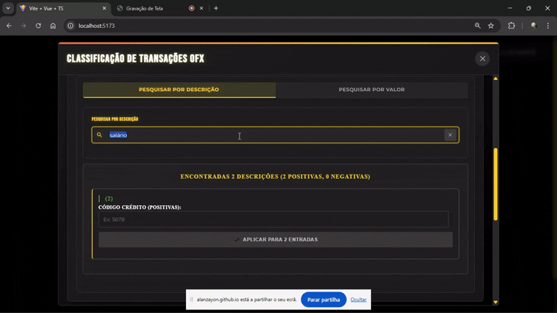
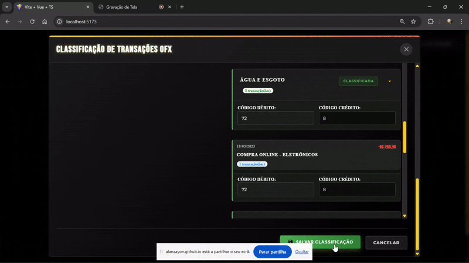
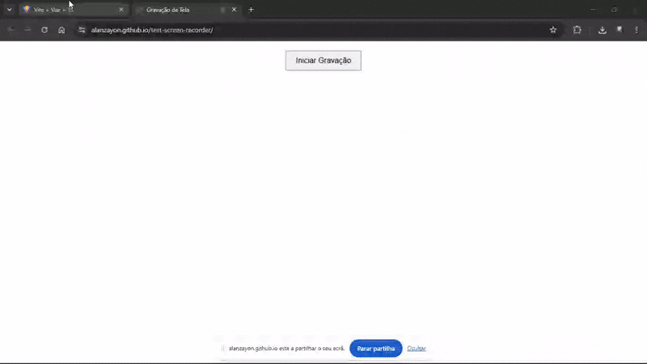
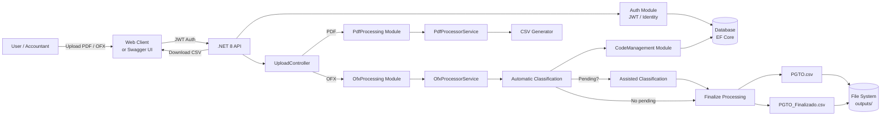

# ApiPdfCsv — Convert PDFs/OFX into standardized CSV files for accounting systems

**ApiPdfCsv** is a .NET 8 API that processes Brazilian tax payment receipts (DARF/DAS) in PDF format and bank statements in OFX format, extracts the relevant data, and generates standardized CSV files ready to be imported into accounting or ERP software.

The solution includes authentication, structured logging, automated tests, and an **automatic / assisted classification workflow** that learns from each user and company (CNPJ).

**Web Client (Frontend):**  
https://pdftoexcel.netlify.app/

---

## Table of Contents
- Who this is for and what problem it solves
- Demos (images and videos)
- How to use it without coding
- Key features
- Understanding the generated CSV (simple explanation)
- Frequently Asked Questions (FAQ)
- Data privacy and security
- For technical users
  - Architecture and modules
  - Requirements
  - Configuration
  - Running the project (Local and Docker)
  - API endpoints
  - CSV structure (detailed)
  - Tests and folder structure
  - Observability
  - Roadmap and versioning
- License

---

## Who this is for and what problem it solves
- **Target audience:** Finance and accounting teams, accountants, and anyone who needs to standardize financial data from PDFs or OFX files into CSV format.
- **Problem:** Each bank and official document uses a different layout and structure, making reconciliation slow and error‑prone.
- **Solution:** Upload a PDF or OFX file, let the API extract dates, amounts, descriptions, and identifiers, learn how you classify transactions, and receive a clean, standardized CSV ready for import.

---

## Demos (images and videos)

The GIFs below show the full OFX workflow, from upload to final CSV generation and automatic learning.

### GIF 1 — Upload, identification, and batch classification by special term


Shows an OFX upload, bank code and company identifier (CNPJ) input, detection of recurring terms in transaction descriptions, and batch classification using a single accounting code.

### GIF 2 — Individual classification followed by global classification


Demonstrates manual classification of specific transactions and then applying a single code to automatically finalize all remaining unclassified transactions.

### GIF 3 — Processing completion and CSV download


Shows the finalization step, download of `PGTO_Finalizado.csv`, and a preview of the generated CSV already formatted according to accounting rules.

### GIF 4 — Intelligent reprocessing with user/company learning


Demonstrates that previous classifications are stored: when the same OFX is uploaded again with the same bank code and CNPJ, all transactions are automatically classified based on learned history.

### GIF 5 — View and edit saved classifications (no new upload required)


Shows how users can review, edit, or correct previously saved classifications for a given bank code and CNPJ without re‑uploading an OFX file.

---

## System Architecture & Processing Flow



> This diagram represents the high-level architecture and main processing flows.
> It intentionally abstracts low-level implementation details to focus on
> responsibilities, data flow, and system boundaries.


## How to use it without coding

### Option A — Web Client
1. Go to https://pdftoexcel.netlify.app/
2. Create an account or log in.
3. Upload a PDF (DARF/DAS) or an OFX file.
4. For OFX files, review pending transactions and confirm classifications.
5. Download the generated CSV and import it into your system.

### Option B — Interactive API Documentation (Swagger)
1. Run the API locally or using Docker (see below).
2. Open: http://localhost:5243/swagger
3. Authenticate (Auth → login → use the token in other endpoints).
4. Upload files using the upload endpoint and download the generated CSV.

---

## Key features
- Processes Brazilian tax PDFs (DARF/DAS) and extracts structured data.
- Processes OFX (SGML) bank statements.
- Automatic transaction classification by description, per user and per company (CNPJ).
- Assisted classification for unknown descriptions.
- Generates standardized CSV files (`PGTO.csv` and `PGTO_Finalizado.csv`) compatible with accounting systems.
- JWT authentication and structured logging.

---

## Understanding the generated CSV (simple explanation)
- The output is a `.csv` file using `;` as the separator.
- When processing DARF/DAS, each transaction is represented by **two rows** (debit and credit).
- When processing OFX files, transactions are kept as a **single row**.
- Negative values are converted to positive numbers, and debit/credit positions are adjusted according to accounting rules.
- When available, the bank code is used to standardize classification.

You can review the partial CSV (`PGTO.csv`) first and, after completing assisted classification, download the final file (`PGTO_Finalizado.csv`).

---

## Frequently Asked Questions (FAQ)

**What is OFX?**  
OFX is a bank statement file format supported by many banks worldwide.

**Do I need programming knowledge?**  
No. You can use the web client or Swagger UI.

**Does it work with any bank?**  
Yes, as long as the bank provides OFX files. The system learns from your data.

**Why is my CSV empty?**  
The uploaded file may not contain valid transactions or may have been parsed with an incorrect encoding.

**How can I improve classification accuracy?**  
Review pending transactions and confirm them. Your feedback is stored and improves future classifications for the same user and company.

---

## Data privacy and security
- JWT-based authentication.
- File size validation and filename sanitization.
- Sensitive data is not written to logs.
- HTTPS and proper CORS configuration are recommended in production.

---

## For technical users

### Architecture and modules
The solution follows a modular and layered architecture:

- **API (Web)**
  - Controllers: `AuthController`, `UploadController`, `DownloadController`, `ConfiguracaoController`
  - Swagger and middleware configured in `Program.cs`
- **Authentication**
  - JWT, email workflows, login/registration DTOs, `ApplicationUser` (ASP.NET Identity)
- **PdfProcessing**
  - PDF processing use cases and `ProcessedPdfData` entity
  - `IFileService` (storage) and `PdfProcessorService` (parsing with iTextSharp)
- **OfxProcessing**
  - `ProcessOfxUseCase`, `ProcessedOfxData`, `FinalizacaoRequest`
  - `OfxProcessorService` for SGML parsing
- **CodeManagement**
  - Entities and services for account codes, taxes, special terms, and repositories
- **CrossCutting**
  - `AppDbContext` (EF Core) and identity configuration
- **Shared**
  - CSV/Excel generation, standardized results, logging utilities

Database migrations are located in `Migrations/` and persist users, classifications, codes, and terms.

---

### Requirements
- .NET 8 SDK
- Optional: Visual Studio 2022 or VS Code
- Database configured via `ConnectionStrings:DefaultConnection`

---

### Configuration (`appsettings.json` — minimal example)
```json
{
  "ConnectionStrings": {
    "DefaultConnection": "Server=(localdb)\\mssqllocaldb;Database=ApiPdfCsv;Trusted_Connection=True;MultipleActiveResultSets=true"
  },
  "FileProcessing": {
    "MaxFileSizeMB": 100,
    "OutputDirectory": "outputs"
  },
  "Serilog": {
    "MinimumLevel": "Information"
  },
  "Jwt": {
    "Issuer": "your-issuer",
    "Audience": "your-audience",
    "Key": "your-secret-key"
  }
}
```

---

### Running the project

#### Local
```bash
git clone https://github.com/AlanZayon/ApiPdfCsv.git
cd ApiPdfCsv
dotnet restore
dotnet build -c Release
dotnet ef database update
dotnet run
```

Swagger: http://localhost:5243/swagger

#### Docker
```bash
docker build -t apipdfcsv:latest .
docker run --rm -p 5243:8080 \
  -e ASPNETCORE_ENVIRONMENT=Production \
  -e ConnectionStrings__DefaultConnection="<your-connection-string>" \
  -v $(pwd)/outputs:/app/outputs \
  apipdfcsv:latest
```

Swagger: http://localhost:5243/swagger

---

### API endpoints (summary)

**Authentication:** Bearer JWT required.

1. **Upload file (PDF/OFX)**
   - `POST /api/Upload/upload`
   - Headers (OFX): `CNPJ: 00000000000000` (digits only)
   - Body: `multipart/form-data`
   - Responses:
     - PDF → structured extracted data
     - OFX pending → transactions + suggestions
     - OFX completed → CSV path

2. **Finalize OFX processing**
   - `POST /api/Upload/finalizar-processamento`
   - Body: `FinalizacaoRequest`
   - Output: `PGTO_Finalizado.csv`

3. **Download file**
   - `GET /api/Download?file=PGTO.csv|PGTO_Finalizado.csv`

4. **Auth**
   - `/api/Auth/login`
   - `/api/Auth/register`
   - `/api/Auth/forgot-password`
   - `/api/Auth/reset-password`

---

### CSV structure (detailed)
- Separator: `;`
- Numeric locale: pt-BR, 2 decimal places
- Each transaction generates **two rows** with positive values
- Debit/credit position depends on original transaction sign
- Outputs:
  - `outputs/PGTO.csv` (partial)
  - `outputs/PGTO_Finalizado.csv` (final)

---

### Tests and folder structure

Run tests:
```bash
cd ApiPdfCsv.Tests
dotnet test
```

Project structure:
```
ApiPdfCsv/
├── src/
│   ├── API/
│   ├── Modules/
│   ├── CrossCutting/
│   └── Shared/
├── Migrations/
├── outputs/
└── ApiPdfCsv.Tests/
```

---

### Observability
- Structured logging with Serilog
- Request correlation via ASP.NET Core
- Recommended production sinks: Elastic, Seq

---

### Roadmap and versioning
- Versioning: Semantic Versioning (MAJOR.MINOR.PATCH)
- Planned improvements:
  - Processing history with pagination
  - Additional exports (full XLSX)
  - Improved bank code suggestion heuristics per company

---

## Author responsibilities
- Backend architecture and implementation (.NET 8)
- PDF and OFX parsing
- Automatic and assisted classification with learning
- JWT authentication and logging
- Standardized CSV generation
- Unit, integration, and E2E tests
- Docker deployment and documentation

---

## Skills demonstrated
- .NET 8, C#
- EF Core, Identity, JWT
- PDF and OFX parsing
- Accounting-oriented CSV generation
- Structured logging (Serilog)
- Automated testing
- Docker and environment configuration
- Modular and scalable architecture

---

## License
MIT License — see the LICENSE file.

**Disclaimer:** This system processes official documents and financial data. Use it only with proper authorization and responsibility.
